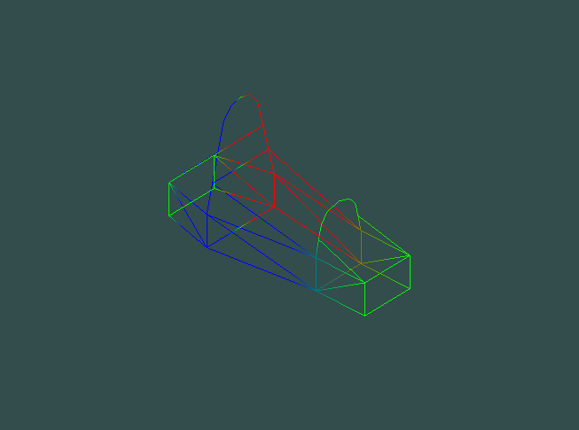
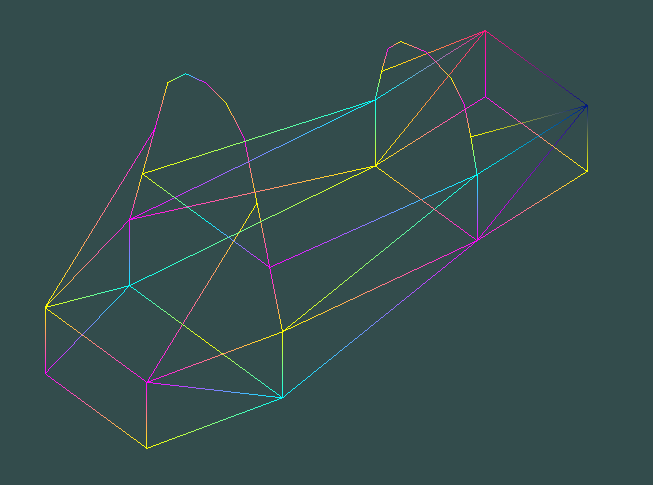

# Structural Frame Finite Element Analysis

Finite Element Analysis solver for 3D structural frames with OpenGL visualization. Imports a frame definition from a text file and builds a set of linear equations that relate the forces on the structure to the deflections of the structure via a stiffness matrix made by combining the individual stiffness matrices of each element. Each element can have its own physical properties (Radius, Elastic Modulus, Shear Modulus) defined in the file. Boundary Conditions are applied to make the stiffness matrix non-singular and therefore invertible. The linear equation set is solved using iterative methods, either Jacobi or Successive Over-relaxation. After solving for displacements and unknown forces the 3D model is colorized to visualize deflection.

FSAE car frame with deflection

Jacobi iteration is considered "embarrassingly parallel" in that data does not need to be shared or passed between threads or process in order for multiple portions of the problem to be solved concurrently and can be implemented easily in OpenMP or MPI.

Successive Over-relaxation (and Gauss-Seidel) increases convergence rate by using intermediate results during a particular iteration. This means data needs to be shared between threads and/or processes. One way to overcome this limitation is to use a “multicolor” SOR method where the linear equations are first segregated into sets where the unknowns in one set are independent of the unknowns in another. One way to do this is to assign every node a “color” such that no two nodes that are part of an element share the same color. By doing this the equations can then be reordered by color to allow each color to be solved on its own thread/process.

Nodes grouped into independent "color" sets

At the moment I have Jacobi and Successive Over-relaxation both implemented with single threading as well as Jacobi implemented with multiple threads/processes using OpenMP and MPI. I am currently working on a multicolor SOR method to allow parallel SOR. Unfortunately, Jacobi does not converge for the FSAE car frame example. I am still investigating if this is a consequence of the frame geometry itself or poor boundary conditions. The post boundary condition stiffness matrix is neither strong, weak, nor irreducibly diagonally dominant so neither Jacobi nor SOR are guaranteed to converge. I have not checked the spectral radius but given Jacobi does not converge we can conclude it is >= 1.

### Dependencies and Build instructions
This project has currently only been tested on WSL Ubuntu but I will be trying to test on other distributions and potentially adding a windows version as well.

#### TLDR
    sudo apt update  
    sudo apt install cmake  
    sudo apt install mesa-utils  
    git clone --recurse-submodules https://github.com/Andrew-Moody/numerical-analysis.git
    cd [repo location]/build
    cmake ../
    cmake --build [repo location]/build
    cd [repo location]/build/numerical_analysis
    ./numerical_analysis

Run with MPI

    cd [repo location]/build
    cmake ../ -DENABLE_MPI=true
    cd [repo location]/build/numerical_analysis
    mpirun -n [number of processes] numerical_analysis

#### More Details
Ubuntu comes with gcc which should support OpenMP out of the box. You just need to have the -fopenmp compiler flag set which should be handled correctly with the provided CMake files.

You will need to have CMake installed to build. I tried to keep the minimum version reasonable but there are a few features that require 3.13 or above. If the version of ubuntu you have is recent it should come with a high enough version to install directly. It is recommended to check for package updates first.

    sudo apt update
    sudo apt install cmake

You will also need to have OpenGL support for graphics. If you use a desktop environment I believe it should already work. If you are using a more minimalist setup like WSL the easiest way to get OpenGL support is probably to install mesa-utils.

    sudo apt install mesa-utils

The rest of the dependencies are included as submodules and built during the same build step as the main executable. when cloning the repo you will need to clone recursively for this to work.

    git clone --recurse-submodules https://github.com/Andrew-Moody/numerical-analysis.git 

For the curious the included dependencies are: GLFW, GLAD, and Assimp. GLAD doesn't actually have a repo that can be submoduled you just generate files for your configuration using a web based tool. I've included a set of generated files with the required license. Hopefully there aren't any issues caused by incompatible configurations.

Next you will need to configure for building using CMake. We need to tell CMake where to look for files and where to output results. The simple way is to first navigate to the build folder located under the repo folder. from there execute the cmake command using the parent folder as the argument (../) which tells CMake to look in the repo folder (one directory up from current) and place configuration output in build (the current directory). [repo] is the path to the cloned repository (should be named numerical_analysis by default)

    cd [repo]/build
    cmake ../

If this is confusing the following command works without having to be in a specific directory first.

    cmake -B [repo]/build -S [repo]

Now you can actually build the project using make from the build directory (or use cmake --build [path to build directory]). It might take a bit of time to build the first time due to Assimp's size.

    cmake --build [repo]/build

And finally, to run the resulting executable you will need to first navigate to the folder it was built into otherwise file paths will not work correctly (looking for a work around for this).

    cd <repo>/build/numerical_analysis
    ./numerical_analysis

By default MPI is disabled and is still experimental. If your system supports MPI and you want to enable it you will need to pass a flag to the cmake command

    cmake ../ -DENABLE_MPI=true

Instead of running the executable normally you have to run with an MPI command specifying the number of processes to launch

    mpirun -n [number of processes] numerical_analysis